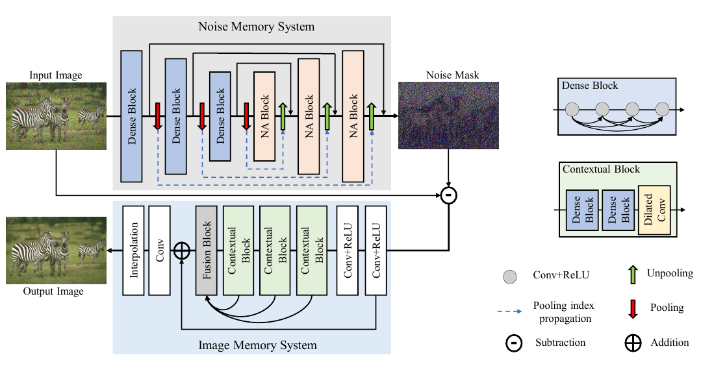

# SMNet
Single Image De-noising via Staged Memory Network

## Abstract
Single image de-noising is an important yet under-explored task toestimate the underlying clean image from its noisy observation. Itposes great challenges over the balance between over-de-noising(e.g., mistakenly remove texture details in noise-free regions) andunder-de-noising (e.g., leave noisy points). Existing works solelytreat the removal of noise from images as a process of pixel-wiseregression and lack of preserving image details. In this paper, wefirstly propose aStaged Memory Network (SMNet)consistingof noise memory stage and image memory stage for explicitlyexploring the staged memories of our network in single image de-noising with different noise levels. Specifically, the noise memorystage is to reveal noise characteristics by using local-global spatialdependencies via an encoder-decoder sub-network composed ofdense blocks and noise-aware blocks. Taking the residual resultbetween the input noise image and the prediction of the noisememory stage as input, the image memory stage continues to geta noise-free and well-reconstructed output image via a contextualfusion sub-network with contextual blocks and a fusion block. Solidand comprehensive experiments on three tasks (i.e. synthetic andreal data, and blind de-noising) demonstrate that our SMNet cansignificantly achieve better performance compared with state-of-the-art methods by cleaning noisy images with various densities,scales and intensities while keeping the image details of noise-freeregions well-preserved. Moreover, interpretability analysis is addedto further prove the ability of our composed memory stages.Wepromise to release our codes and models as soon as possible.

### Network architecture

## Commands
### Training dataset
The training dataset is downloaded at https://pan.baidu.com/s/1gUzKJBr1cdO963sm6FXZFQ  extraction code：9txx
#### create training dataset of rgb images
`python dataset.py` 
#### create training dataset of gray images
`python dataset_gray.py` 

### SMNet weights
The weights of SMNet are downloaded at https://pan.baidu.com/s/1Dg2813dXUlvJ20HZdG9G3A extraction code：k7ov

### Training
#### Train SMNet-S (SMNet with known noise level)
`python train_rgb.py --batchsize 8 -checkpoint 0 --noiseL 25`

`python train_gray.py --batchsize 8 -checkpoint 0 --noiseL 25`

#### Train SMNet-B (SMNet with blind noise level)
`python train_rgb_blind.py --batchsize 8 -checkpoint 0`

`python train_gray_blind.py --batchsize 8 -checkpoint 0`

### Testing
#### Test rgb noisy images
`python test_rgb.py -checkpoint 40 --mode S --test_noiseL 15 --test_data McMaster`

#### Test gray noisy images
`python test_gray.py -checkpoint 40 --mode S --test_noiseL 15 --test_data Set12`

### Test results

